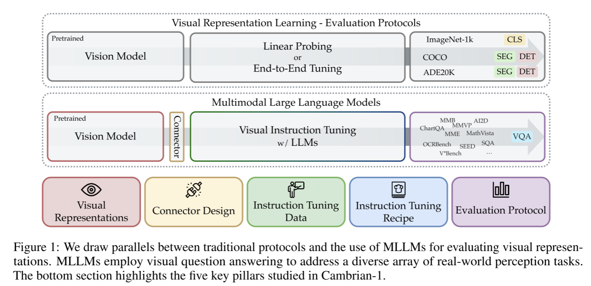
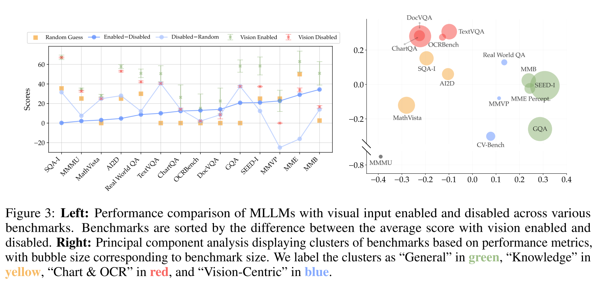
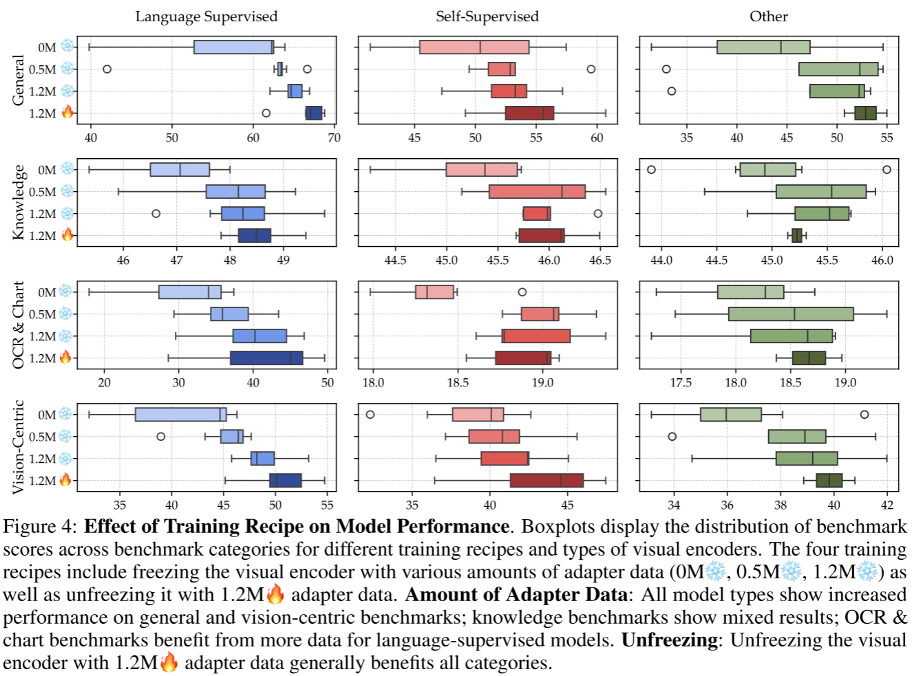
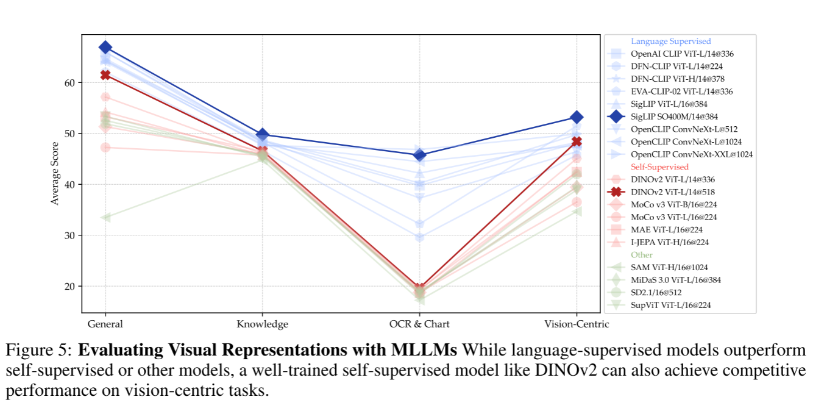
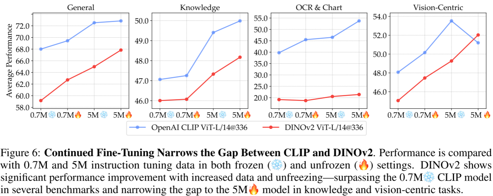
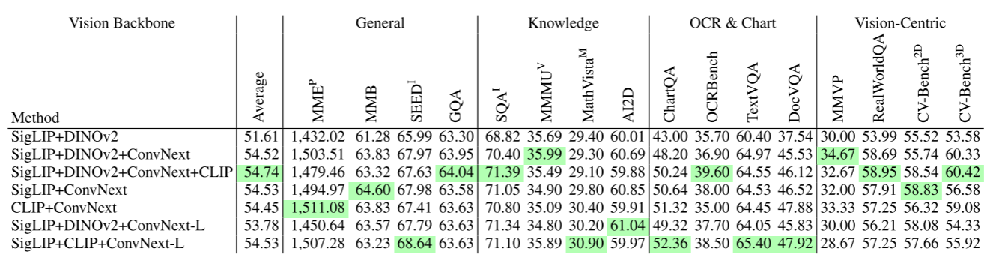
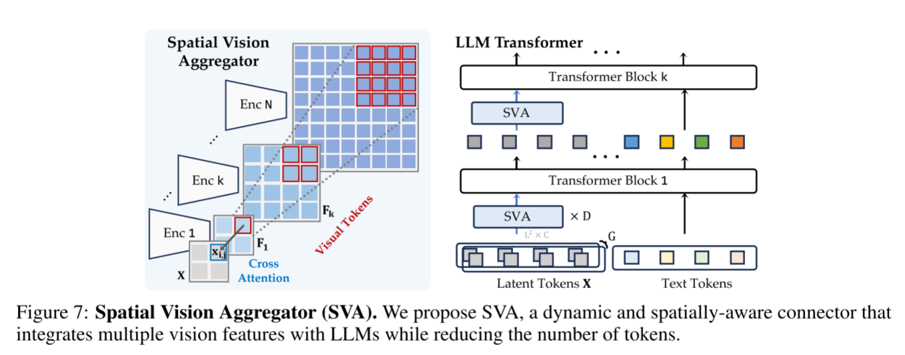
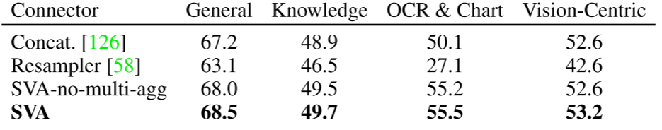
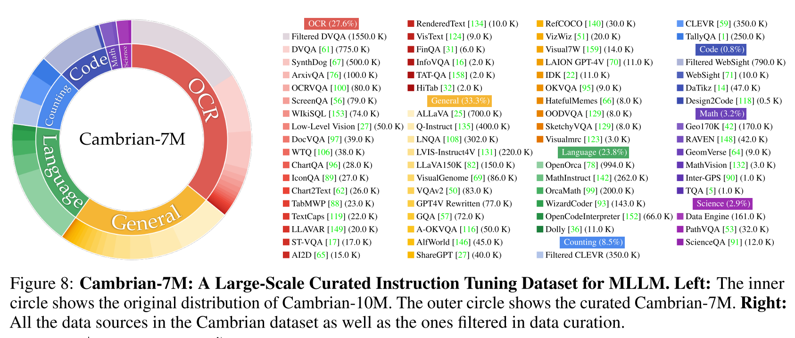
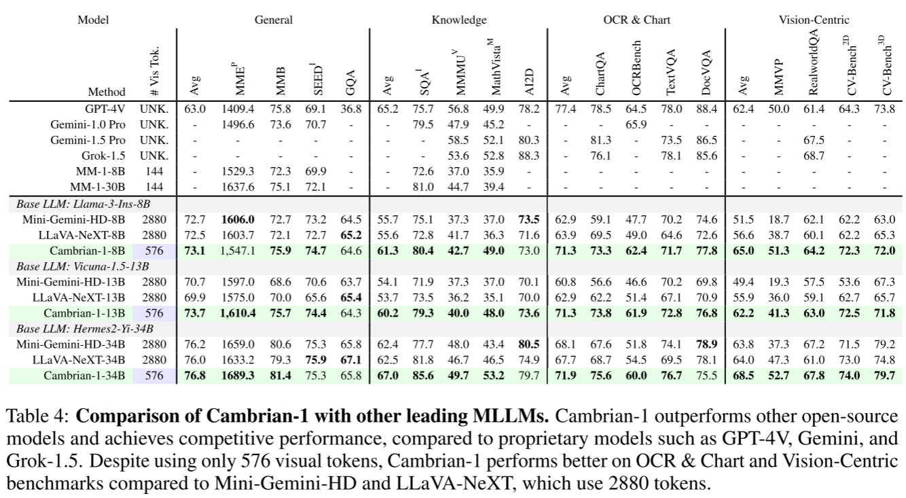

为了监督自己同时记录下看过的有意义的论文，我决定在个人主页上每天更新一篇论文阅读笔记，希望能和大家一起探索奇妙的ai世界。

在决定入坑MLLM后，我的朋友们推荐了Cambrian作为入坑论文，这确实是一篇非常值得仔细阅读的经典论文。

本篇文章的出发点在于MLLM的最近发展很大程度上是由更强大的LLM推动的，而视觉组件一直没有得到充分的探索并且与视觉表征学习严重脱节。此类研究的主要挑战在于MLLM涉及复杂的训练和评估pipline,需要考虑很多方面。本文从vision-centric的角度来探究MLLM，并且以往视觉表征常用的Linear Probing或者End-to-End Tuning不同，本文使用MLLM来评估不同的视觉表征。

在ImageNet-1k,COCO和ADE20K这样的数据集上的Linear Probing和End-to-End Tuning测试已经趋于饱和，而MLLM进行VQA提供了一种灵活而鲁棒的评估方法，可以更有效反应现实世界的场景。

本文还介绍了以vision-centric方法涉及的MLLM家族Cambrian-1，通过Visual Representations, Connector Design, Instruction Tuning Data, Instruction Tuning Recipe, Evaluation Protocal五个关键支柱来提供insight，下面也将从这五个角度来讲述这篇文章。

## Evalution Protocal

在训练模型前，我们需要先选择好模型的测试benchmark,那么作者提出疑问，现在的benchmark可以很好地衡量MLLM的视觉表征能力吗？或者说benchmark真的需要视觉输入吗？作者对一系列常用的benchmark进行了测试。实验发现在大部分benchmark上，视觉输入对于模型得分影响不大。对分数进行PCA分析，可以大致将benchmark分为4大类，图中圆的大小代表了benchmark的数据量。可以发现：vision-centric的数据集不仅数量少，而且benchmark数据也不足。

#### ***发现1：大部分现存的benchmark不能正确测量Vision-Centric能力，并且能测试此能力的benchmark样本量很少***

针对这一问题，作者通过将传统数据集重组为VQA问题来测试MLLM的vision-centric能力， 通过人工确认的2638个实例创建了**CV-Bench**,是Real-WorldQA的3.5倍，是MMVP的8.8倍。

#### ***发现2：现有的benchmark可以有效地重组为VQA问题，测试MLLM的vision-centric能力***

## Instruction Tuning Recipes

MLLM一般由视觉编码器，语言编码器（LLM），连接器这三个模块组成。原始的LLaVA提出了两阶段训练过程：首先冻结LLM和视觉编码器，用adapter数据数据来预训练连接器，然后解冻LLM用instruction tuning数据进行微调。有一些文章认为跳过连接器的预训练可以在不损害性能的情况下减小计算消耗。也有文章认为解冻视觉编码器更有效。 就哪种训练策略更适合MLLM训练作者进行了实验。

#### ***发现3：两阶段训练效果更好，并且微调数据越多性能越好***

#### ***发现4：解冻视觉编码器效果更好，并且SSL类模型在vision-centric的benchmark上提升尤其明显***

## Visual Representations

相比于传统视觉表征测评方法，MLLM可以更灵活且鲁棒。采用之前实验得到的结论，利用两阶段的指令微调，1.2M的adapter数据，737k的fine-tuning数据，解冻视觉编码器训练的MLLM作为benchmark测试了现有视觉组件的视觉表征能力。

#### ***发现5：更高分辨率的视觉编码器可以有效提升在图表和视觉中心的性能，并且卷积网络结构更适合这类任务***

语言监督的模型因为有语言作为额外监督所以普遍性能优于SSL类模型，特别是在图表/OCR上，作者认为这是语言监督训练过程有大量文本数据。于是作者尝试增加微调数据进行实验。

#### ***发现6：语言监督模型具有强大的优势，但是可以通过增加足够的微调数据和合适的训练策略使SSL模型减小差距***

通过之前的实验可以发现不同的视觉编码器具有不同的优势，因此自然地结合多个视觉编码器来充分利用视觉表征能力。

#### ***发现7：结合多个视觉编码器，包括SSL模型和语言监督模型可以有效提供MLLM性能，特别是在vision-centric类benchmark中可以大幅提升分数***

## Connector Design

怎么聚合多个视觉编码器的特征是个重要的问题，直接拼接会因为插值造成信息丢失并且平等地对待每个视觉编码器是不合理的，因此作者设计了一个空间视觉聚合器（SVA）

通过一个可学习的2D网格作为query，$X \in R^{L^2 \times C}$ 来交互多个视觉编码器的特征。
$$
\mathbf{q}^*_{i,j} = \text{softmax}\left(\frac{\mathbf{q}_{i,j} \cdot [\mathbf{k}_{i,j,1}, \mathbf{k}_{i,j,2}, \ldots, \mathbf{k}_{i,j,N}]^\top}{\sqrt{C}}\right) [\mathbf{v}_{i,j,1}, \mathbf{v}_{i,j,2}, \ldots, \mathbf{v}_{i,j,N}],
$$

where

$$
\begin{align*}
\mathbf{q}_{i,j} &= \mathbf{W}^Q \mathbf{x}_{i,j} \in \mathbb{R}^{1 \times C}, \\
\mathbf{k}_{i,j,k} &= \mathbf{W}_k^K \mathbf{F}_k [m_k \cdot i : m_k \cdot (i+1), \, m_k \cdot j : m_k \cdot (j+1)] \in \mathbb{R}^{m_k^2 \times C}, \\
\mathbf{v}_{i,j,k} &= \mathbf{W}_k^V \mathbf{F}_k [m_k \cdot i : m_k \cdot (i+1), \, m_k \cdot j : m_k \cdot (j+1)] \in \mathbb{R}^{m_k^2 \times C}.
\end{align*}
$$
实验证明了SVA的有效性

#### ***发现8：空间 inductive bias与llm和视觉特征的深度交互有利于更好地聚合和浓缩视觉编码特征***

##  Instruction Tuning Data

因为高质量的多模态数据缺乏，作者从互联网搜集了一个大型的指令调优数据池Cambrian-10M,包含了各个领域的数据。

## Cambrian-1

最后作者利用之前的所有研究见解训练了Cambrian-1的系列MLLM，在仅使用$\frac{1}{5}$的token就超越了如LLaVa-NeXT和Mini-Gemini等开源模型并开源了模型权重，代码，数据集，详细参数配置。

#### 审稿人意见

四位审稿人给出的分数为7 8 7 6并在rebuttal后维持原始分数，他们都认为本文进行了充分的实验，得出了有效的结论，并且对于MLLM社区贡献巨大。弱点集中在所提出的SVA方法novelity并不高，并且已经有类似的相关工作存在；本文得出的一些结论如高分辨率视觉编码器有益于模型的性能在类似的文章中也有揭示。作者在rebuttal中提出本文是第一篇系统性研究MLLM中视觉组件的作用和规律的文章区别于之前文章孤立地探究视觉组件的某一性质；相比于LLaVA使用的动态token方法，本文提出的SVA在仅使用576个token就超越了以往方法的性能。最后PC认为本篇文章贡献是solid的，对于MLLM社区有巨大的贡献，尽管novelty受限，依然接受为Oral文章

#### 我的看法

本文的优点在于：1.系统性研究了MLLM的视觉组件，做了全面的实验，得出了很多有益的结论，对于MLLM的发展和学习贡献巨大。2.本文对现有的benchmark批判性评估，发现了现有benchmark对于视觉为主任务的不足，并建立了一个新的benchmark来专门评判MLLM视觉能力，这个发现问题的角度很值得学习。3.尽管审稿人认为本文提出的SVA的novelty不足，但是我觉得作者是在发现融合多个视觉编码器可以有效提升MLLM能力后自然提出SVA来改进特征的空间聚合并且达到了优秀的效果，那么这就是一个优秀的方法。4.本文利用上述的所有发现训练了Cambrian-1族MLLM，在各个benchmark上达到了sota，证明了他们发现的有效性，可以指导MLLM的训练和架构设计

本文的缺点在于：1.虽然本文对视觉组件系统性地进行了研究，但是有些发现与现有工作重叠，比如高分辨率编码器效果更好，多个编码器混合可以提升性能，并且局限于在预训练模型上进行微调，如果可以将原生多模态模型纳入实验（如GPT，Rekad）可能会得出更多有意义的结论。2.LLM的成功很大一部分归功于scaling,但是很可惜cv领域的被广泛认可的scaling还没有出现，本文既然从视觉表征的角度探究多模态，那么应该加入对于视觉组件scaling对于MLLM性能的影响。3.本文的做法停留在集成多个视觉表征模型而没有找寻一个统一的基础视觉表征模型，这是较为遗憾的。

我认为现在MLLM的缺陷在于缺乏一个强大的基础视觉表征模型，语言和视觉模态在本质上具有很大的差别，语言的逻辑性是人为定义的，可以通过大量的自回归训练完成。但是视觉需要更多的知识或者先验去支撑其真实分布，包含物理，逻辑，艺术等多个领域，甚至他需要的知识没法通过单一图像的自回归完成。因此怎样更好地完成图像模态的SSL是MLLM的一个重要前置技术。
