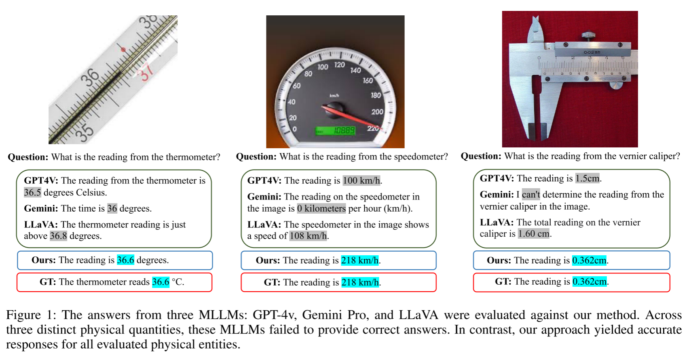
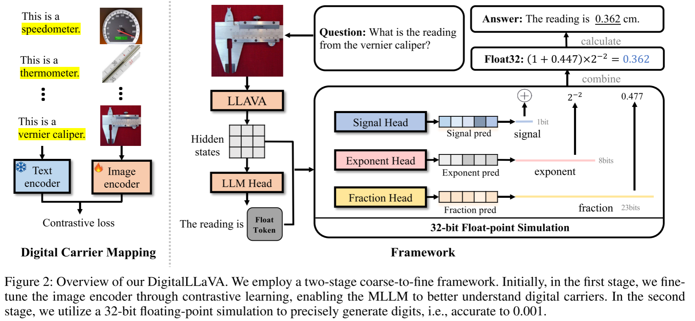
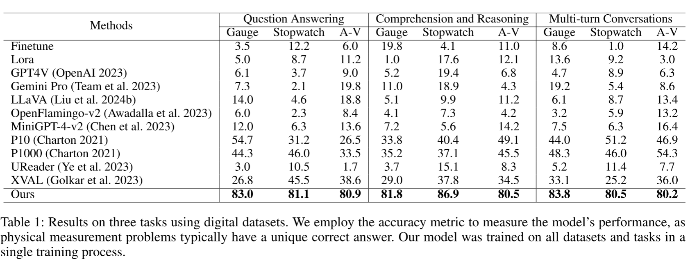
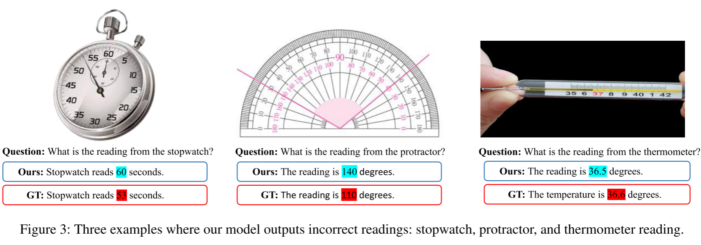

今天分享的是一篇很有意思的2025年AAAI的文章《DigitalLLaVA: Incorporating Digital Cognition Capability for Physical World Comprehension in Multimodal LLMs》

## Motivation

这篇文章的动机是MLLM对物理世界中的数字认知能力不足，如下图所示，在读取各种测量仪器的数据时现有MLLM都会出现错误。而对真实世界中数字的读取在医疗，工程领域是非常重要的。本文提出的DigitalLLaVA可以精确识别各种仪器所显示的数字。

## Method

本文使用了粗到细的两阶段训练策略，第一阶段通过大量物理测量仪器的文本对增加MLLM对于数字载体的认知，第二阶段利用三个专门的预测头来生成一个Float32数字。模型推理时当识别到数字载体会输出[Float]信号，然后通过32-bit的浮点数表示生成实际的读数替换[Float]完成输出。这样的做法是很合理的，作者分析了MLLM不能准确识别数字的原因主要有两点，第一点是因为MLLM对于数字载体不敏感，第二点是在于MLLM用序列预测数字或者特别标记预测数字会导致数字的预测空间非常大，难以准确预测，而本文采用Float32来表示数字，有效地解决了这个问题

在训练过程中，使用CE来训练Signal Head,使用MSE来训练Exponent Head和Fraction Head。
$$
\mathcal{L}_{float} = \left\{
\begin{array}{ll}
-\sum_{i=1}^{N} CE(y_i, \hat{y}_i) \\
\frac{1}{N} \sum_{i=1}^{N} MSE(y_{exp,i}, \hat{y}_{exp,i}) \\
\frac{1}{N} \sum_{i=1}^{N} MSE(y_{frac,i}, \hat{y}_{frac,i})
\end{array}
\right.
$$

## Experiment

实验证明了在三个任务上，本文提出的DigitalLLaVA都达到了特别优秀的性能，远超其他模型

DigitalLLaVA当面对图像不清晰时会出现问题，作者认为需要更强大的视觉编码器或者进行更多微调

