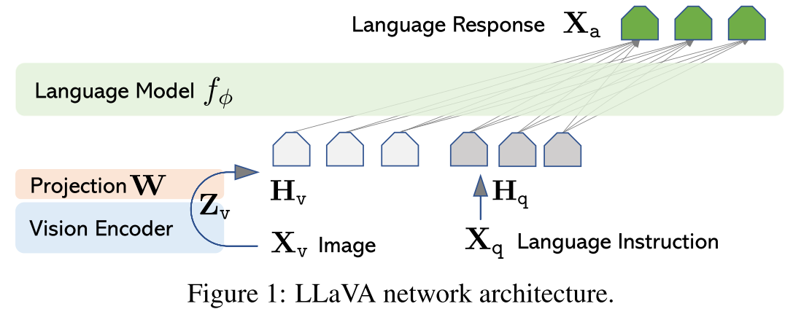

MLLM的连接器有三大类方式：以LLaVA-1.5为代表的MLP，以BLIP-2为代表的Q-Former，以Flamingo为代表的Resampler。其中MLP因为其更小的参数量和最简单的形式被广泛用于后续研究。今天我们分享的是就是LLaVA-1.5的前身LLaVA，在2023NIPS的Oral《Visual Instruction Tuning》中提出。

## Abstract

使用机器生成的instruction-following数据集对LLM进行instruction-tuning被证明可以显著提高新任务的zero-shot性能，但是在多模态领域还没有被充分探究。本文第一次使用只接触到语言的GPT-4生成多模态instruction-following数据.通过在这些数据上进行instruction-tuning本文提出了新的MLLM结构：LLaVA（Larrge Language and Vision Assistant），本文还提出了两个面向任务的benchmark。

