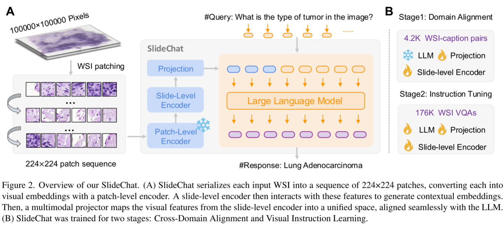
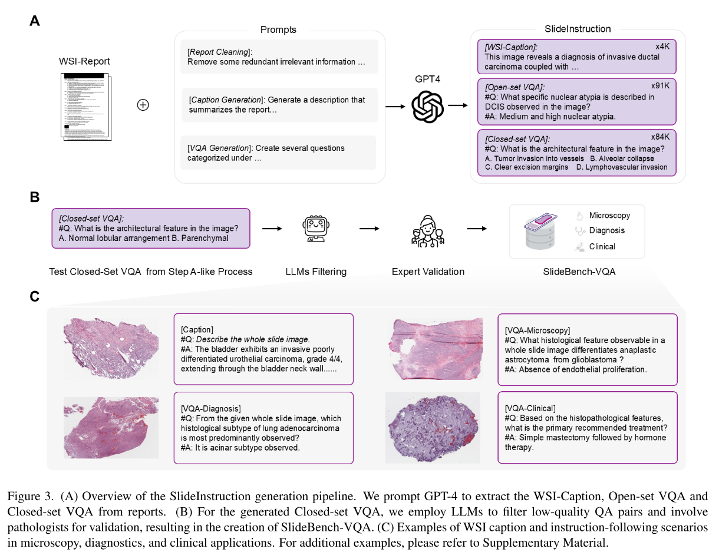

今天分享的是一篇2025CVPR的医疗MLLM-《SlideChat:A Large Vision-Language Assistant for Whole-Slide Pathology Image Understanding》

## Abstract

MLLM在计算病理方面的取得了一定的进展，但是MLLM在全病理切片（WSI）的应用受限于主要关注patch-level而缺乏上下文信息。本文介绍了SlideChat，第一个可以理解十亿像素级别的WSI的MLLM。本文还介绍了Slide-Instruction,WSI最大的指令跟随数据集，包含4.2K的WSI 注释和176K的VQA对。在此基础上，本文提出了SlideBench，包含了captioning和VQA的MLLM测评基准。

## 模型架构

SlideChat采用LLaVA架构，由Patch-Level Encoder,Slide-Level Encoder,Projection，LLM组成，相较于一般LLaVA增加了一个Slide-Level Encoder模块来增强Patch-level的视觉特征。Patch-Level Encoder采用COCNH的冻结的视觉编码器，Slide-Level Encoder采用LongNet，使用稀疏注意力学习局部和全局的上下文信息，使用Qwen2.5-7B-Instruction作为LLM。采用和LLaVA一致的两阶段训练策略，第一阶段冻结LLM和Patch-Level Encoder，用4.2K的WSI caption数据训练Slide-Level Encoder和Projection进行对齐。第二阶段使用176K的VQA对进行Instruction Tuning,这一阶段解冻LLM。

## 数据

针对缺乏大规模WSI多模态数据集的问题，本文建立了SlideInstruction,源自TCGA，包含来自4028名病人的4915个WSI报告对。先使用GPT4对于报告进行规范化处理，包含去除不相关的符号，冗余的行政或法律申明等信息，然后再利用GPT4生成WSI-Caption和VQA数据。caption包含整张WSI的信息，VQA分为开集和闭集问题。每个WSI生成2个开集问题，两个闭集问题并去除一些缺乏对应类信息的VQA对。在分割训练/测试集时，WSI-报告对分为两种情况：1）一份报告对应多份WSI，2）一份报告对应一份WSI。对于第一种情况将所有WSI放进训练集中，低于第二种情况，80%为训练集，20%为测试集。最后有4181份WSI作为训练集，734份WSI作为测试集。遵循PathChat中的分类，本文将问题分为microscopy, diagnosis,clinical三个大类，对应病理学的三个阶段，细分为11个类 microscopy包括组织结构，肿瘤特征，组织病理学变化，组织细胞学特征 diagnosis包括疾病检测，分期，分级，疾病分类，鉴别诊断 clinical包含治疗指导，危险因素，预后评估，生物标志物分析。

为了测试模型性能，本文建立了 SlideBench，分为SlideBench-Caption,SlideBench-VQA(TCGA),SlideBench-VQA(BCNB)三部分。SlideBench-Caption检验的是模型根据WSI给出caption的能力，SlideBench-VQA(TCGA)建立在734份WSI的闭集问题上，为了确保benchmark的有效性，本文使用GPT-4,InterLM2-Chat-7B,Qwen-7B-Chat,Deepseek-7B-Chat在不输入图片的情况下对问题进行回答，去除正确率3/4上的问题，然后请专家对问题进行筛选，得到了包含7827个闭集VQA。本文还将Early Breast Cancer Core-Needle Biopsy(BCNB) WSI数据集从分类转为VQA，得到了来自1058名患者的7247个问题。

