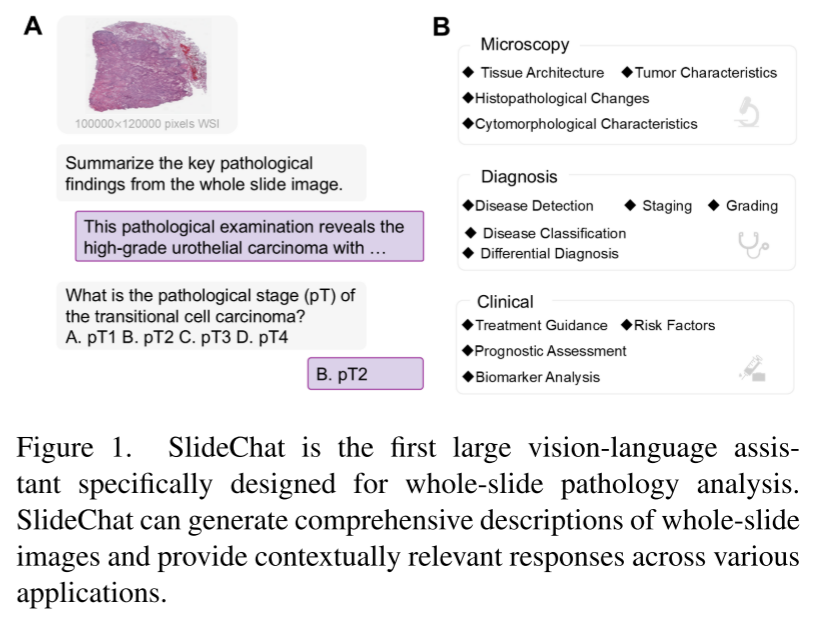

今天分享的是一篇2025CVPR的医疗MLLM-《SlideChat:A Large Vision-Language Assistant for Whole-Slide Pathology Image Understanding》

## Abstract

MLLM在计算病理方面的取得了一定的进展，但是MLLM在全病理切片（WSI）的应用受限于主要关注patch-level而缺乏上下文信息。本文介绍了SlideChat，第一个可以理解十亿像素级别的WSI的MLLM。本文还介绍了Slide-Instruction,WSI最大的指令跟随数据集，包含4.2K的WSI 注释和176K的VQA对。在此基础上，本文提出了SlideBench

