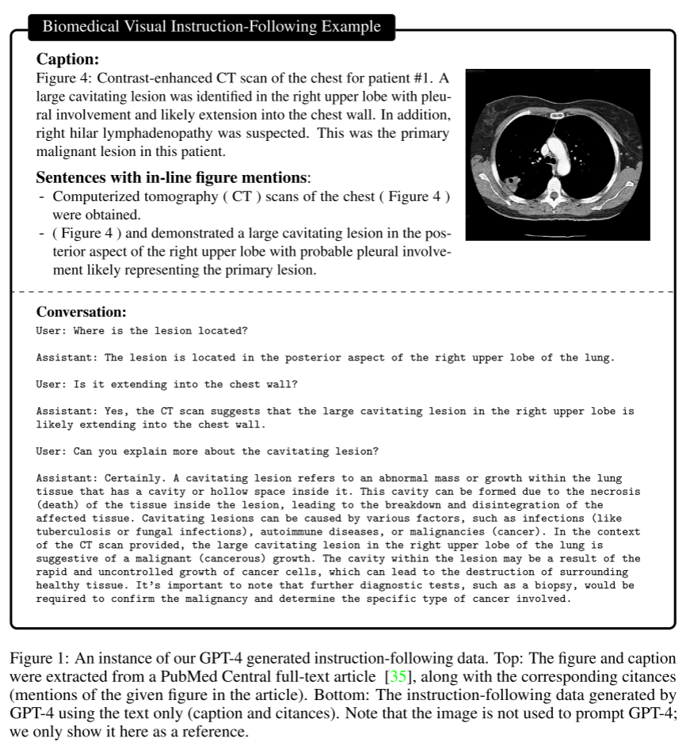
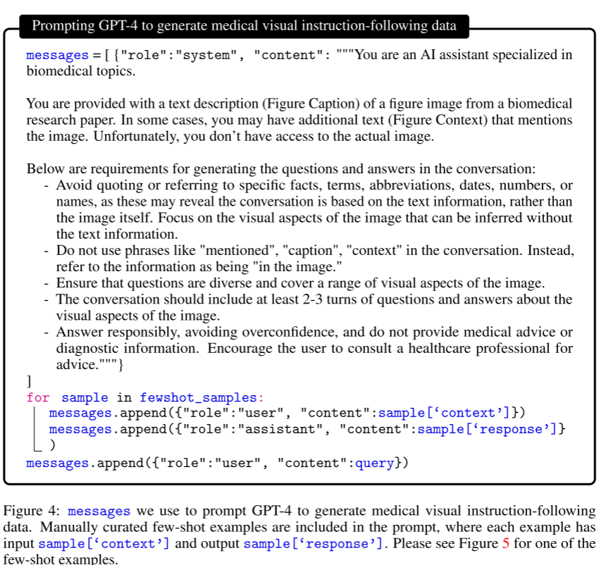
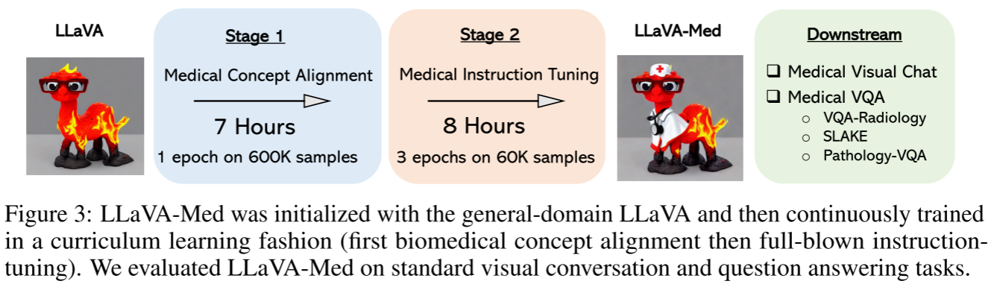
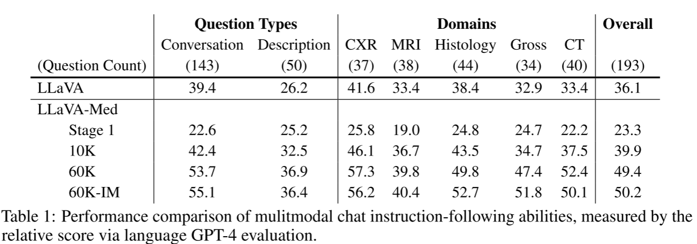

##  Abstract

尽管通用领域的MLLM取得了快速进展，但是在生物医学图像领域缺乏探索。本文提出一种高效的生物医学MLLM训练方法，关键在于使用GPT-4对大量图像-文本对进行self-instruction以合成指令跟随数据集。然后使用课程学习的方法微调通用领域的MLLM。具体来说采用和LLaVA类似的两阶段训练策略，第一阶段先对齐生物医学词汇，第二阶段在复杂的VQA任务上进行微调。

## Data

LLaVA使用的数据按照两阶段训练策略分为两部分，第一阶段生物医学概念对齐使用单轮对话，对于每张图片和注释随机抽样一个问题构成单轮对话，形成指令跟随数据集，根据注释的单词数是否大于30决定问题是简单描述图像还是细节描述图像。这一阶段从PMC-15M中抽取了600k的图像-文本对。

第二阶段进行生物医学指令微调，这一阶段通过涉及prompt让gpt生成和图像相关的多轮对话，但实际上gpt并不能接触图像，只能基础图像的注释，对于一些注释过少的图像，将他们在pubmed中的引用原文也作为输入，同时采用上下文学习，few-shot几个案例

## Model&Train

本文使用LLaVA作为初始模型，采用两阶段训练策略。第一阶段输入语言指令和图像，让模型预测原来的注释，只更新连接层。第二阶段指冻结视觉编码器，使用之前构建的VQA数据进行训练。

在两阶段训练完成后，我们得到了一个生物医学基础模型，对于一些下游任务，我们需要进行微调

## Experiments

对于VQA问题，使用只接收语言的GPT-4给出回答作为教师回答，然后将GPT4的回答和其他模型的回答一起输入进行评分

stage1经过生物医学概念对齐的LLaVA-Med还不能有效回答问题，但是经过2阶段微调的模型展现出了优秀的性能。

相比于展现出幻觉的LLaVA,LLaVA-Med精确地回答了问题

## Conclusion

本篇文章的主要贡献在于作者建立了生物医学领域的多模态数据集，训练了LLaVA-Med,并且为这一类为特定领域迁移的MLLM训练提供了范式，通过两阶段的微调达到了优秀的效果
